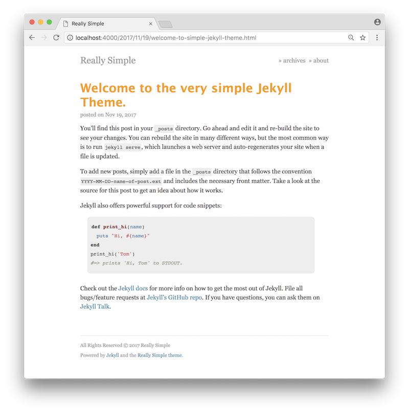
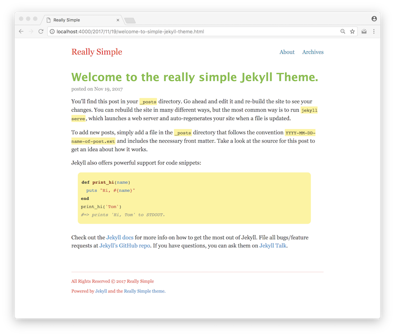

[](https://circleci.com/gh/jusx/really-simple/tree/master)
[](https://badge.fury.io/rb/really-simple)

# Really Simple

Really Simple is a really simple [Jekyll](https://jekyllrb.com) theme. It is barebones and is meant to get a blogging site up very quickly. The Really Simple design is basic yet aesthetically pleasing. In other words it's good enough for an MVP allowing the author to quickly publish content without worrying about the details.



There are no bells and no whistles. Those can be added later -- when the author is ready.

Preview the theme to [see what it looks like](https://jusx.github.io/really-simple/).

## Usage
This Really Simple Jekyll theme is a gem.

In your `Gemfile` add the line:

```
 gem 'really-simple'
```

In your `_config.yml` file specify the theme and title:

```yml
theme: really-simple
title: Your Title
```

And then execute:
```
$ bundle
```

Now create or update your `archives.md` in the project root folder. Specify the archives layout:

```
---
layout: archives
---
```
Any content in this file will be included in the page.

Alternately you can simply fork this repo and go from there.

## Customization

The color palette can be customized by changing the rgb in `_sass/_colors.scss`. If using the gem, merely create the file `_colors.scss` under the folder `_sass` and set the colors appropriately. Here's an example:

```scss
$header-text-color: #ee4035;
$content-text-color: #333;
$footer-text-color: #ee4035;

$post-link-color: #7bc043;
$normal-link-color: #0392cf;
$hover-link-color: #f37736;

$table-border-color: #eee;
$blockquote-txt-color: #999;
$blockquote-border-color: #fdf498;
$code-bg-color: #fdf498;
```
The above will render the palette like so:



## Details

- Really Simple will display up to three posts fully on the home page.

- Link to archives in the header and at the end of the home page will only display when there are more than 3 posts.

- The header has two links: `Archives` and `About`. Really Simple expects these files to be in the root project folder. The `jekyll new` command will create a dummy `about.md` file in the root folder. Remove the layout metadata so that the Really Simple default template is used.

## Philosophy

The Really Simple theme is meant to be minimal and be a design starting point. It follows the following principles:

- It should work out of the box without additional configuration.

- It should be lightweight. No external dependencies on CSS or JS frameworks.

- It should be responsive.

## Background

I had been struggling to find a really simple Jekyll theme that supported blogging out of the box. It was either esthetically not pleasing to me or that it had too many bells and whistles forcing me to think about things I did not wish to have to think about immediately. I just wanted to launch.

While flying from Los Angeles (LAX) to San Diego (SAN) our flight was refused landing due to fog. We had to turn back to LAX. After landing back in LAX, Delta booked a bus to drive us to SAN instead. It was late, I couldn't sleep. I was inspired to create and I had time to burn.

So, I hacked this together during the two hour bus ride.

## Contributions
Bug reports and pull requests are most welcome.

## License
Available as open source under the terms of the [MIT License](https://opensource.org/licenses/MIT).
